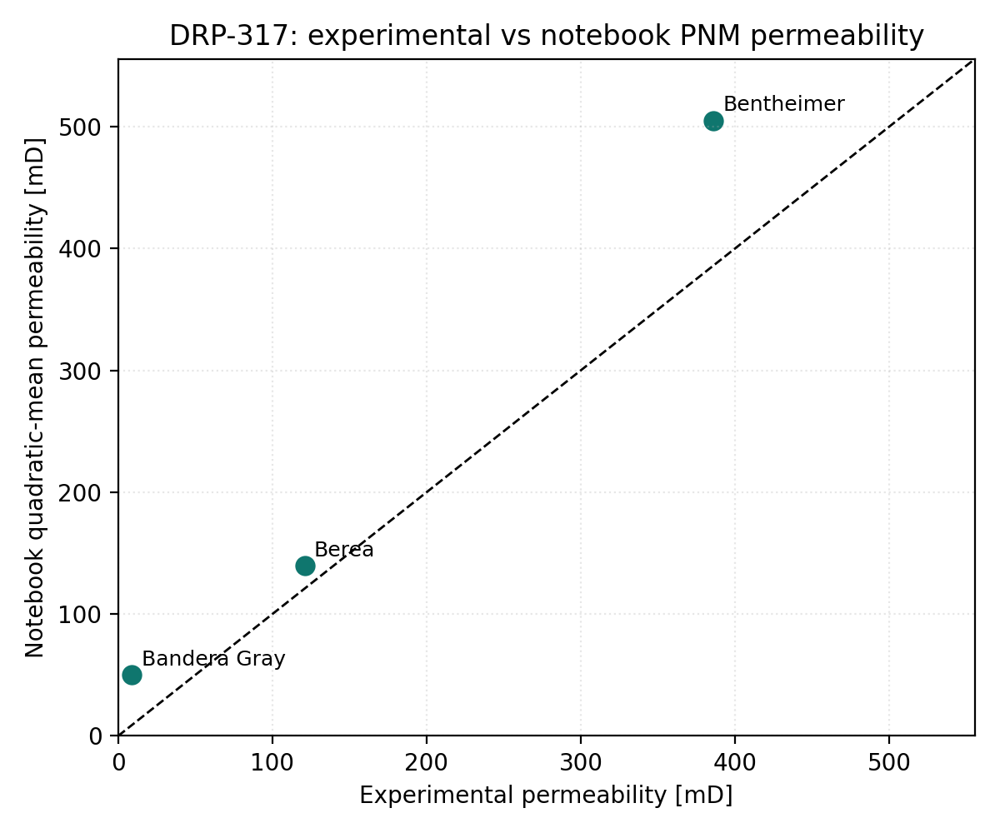
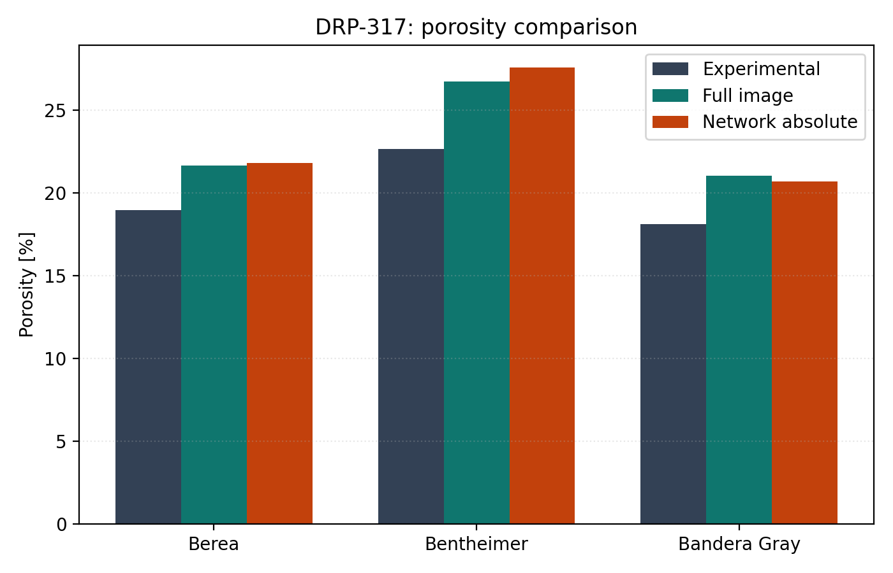

# DRP-317 Sandstone Validation Overview

This report summarizes the current `voids` validation workflow for the three
DRP-317 sandstone notebooks:

- `18_mwe_drp317_berea_raw_porosity_perm`
- `19_mwe_drp317_bentheimer_raw_porosity_perm`
- `20_mwe_drp317_banderagray_raw_porosity_perm`

## Sources

- Dataset: Neumann, R., ANDREETA, M., Lucas-Oliveira, E. (2020, October 7).
  *11 Sandstones: raw, filtered and segmented data* [Dataset].
  Digital Porous Media Portal. <https://www.doi.org/10.17612/f4h1-w124>
- Experimental reference paper: Neumann, R. F., Barsi-Andreeta, M., Lucas-Oliveira, E.,
  Barbalho, H., Trevizan, W. A., Bonagamba, T. J., & Steiner, M. B. (2021).
  *High accuracy capillary network representation in digital rock reveals permeability scaling functions*.
  *Scientific Reports, 11*, 11370. <https://doi.org/10.1038/s41598-021-90090-0>

## Current Notebook Setup

The three notebooks share the same current modeling choices:

- a porosity-matched coarse ROI scan rather than a fixed centered ROI
- `snow2` extraction through the current PoreSpy backend
- `generic_poiseuille` conductance
- pressure-dependent water viscosity from the `thermo` backend
- absolute outlet pressure `5.0 MPa`
- imposed pressure gradient `10 kPa/m`
- reported aggregate permeability as the quadratic mean across `Kx`, `Ky`, and `Kz`

The thermodynamic viscosity path is scientifically cleaner for pressure-aware
workflows, but it is not the dominant effect in these DRP-317 runs. Across a
2.25 mm cube, the imposed pressure drop is only a few pascals, so the water
viscosity field changes negligibly around the 5 MPa reference level. In the
current runs, the nonlinear solve converged in one Newton iteration for all
three rocks.

## Summary Table

The underlying summary CSV is committed as
[`docs/assets/validation/drp317_summary.csv`](../assets/validation/drp317_summary.csv).

| Sample | Notebook | Experimental porosity [%] | Full-image porosity [%] | Network porosity [%] | Experimental permeability [mD] | Quadratic-mean permeability [mD] | Relative permeability error [%] |
|---|---|---:|---:|---:|---:|---:|---:|
| Berea | `18_mwe_drp317_berea_raw_porosity_perm` | 18.96 | 21.67 | 21.82 | 121.0 | 139.98 | 15.69 |
| Bentheimer | `19_mwe_drp317_bentheimer_raw_porosity_perm` | 22.64 | 26.72 | 27.57 | 386.0 | 505.19 | 30.88 |
| Bandera Gray | `20_mwe_drp317_banderagray_raw_porosity_perm` | 18.10 | 21.03 | 20.70 | 9.0 | 49.97 | 455.20 |

## Figures

## Interpretation

The current workflow is closest for Berea, still materially high for
Bentheimer, and far too high for Bandera Gray. The main signal from this
validation set is not a nonlinear-viscosity issue; it is that the image-to-
network reduction and ROI representativeness remain the dominant contributors to
the permeability mismatch.

This is consistent with the original paper: even their own PNM baseline was
substantially less accurate than the higher-detail CNM workflow. The DRP-317
validation pages therefore provide a realistic target for the current `voids`
PNM implementation rather than an expectation of exact agreement.

## Sample Reports

- [DRP-317 Berea notebook report](drp317_berea.md)
- [DRP-317 Bentheimer notebook report](drp317_bentheimer.md)
- [DRP-317 Bandera Gray notebook report](drp317_banderagray.md)
