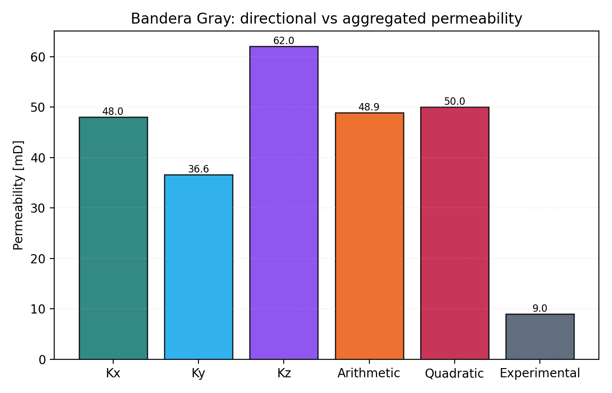

# DRP-317 Bandera Gray Notebook Report

Notebook: `20_mwe_drp317_banderagray_raw_porosity_perm`

## Sources

- Dataset: Neumann, R., ANDREETA, M., Lucas-Oliveira, E. (2020, October 7).
  *11 Sandstones: raw, filtered and segmented data* [Dataset].
  Digital Porous Media Portal. <https://www.doi.org/10.17612/f4h1-w124>
- Experimental reference paper: Neumann, R. F., Barsi-Andreeta, M., Lucas-Oliveira, E.,
  Barbalho, H., Trevizan, W. A., Bonagamba, T. J., & Steiner, M. B. (2021).
  *High accuracy capillary network representation in digital rock reveals permeability scaling functions*.
  *Scientific Reports, 11*, 11370. <https://doi.org/10.1038/s41598-021-90090-0>

## Current Setup

- Raw volume: `BanderaGray_2d25um_binary.raw`
- ROI size: `500 x 500 x 500` voxels
- Selected ROI origin: `(500, 500, 250)`
- Conductance model: `generic_poiseuille`
- Viscosity model: tabulated water viscosity from `thermo`, `298.15 K`
- Boundary pressures: `pout = 5.0 MPa`, `pin = pout + 10 kPa/m * L`

## Key Results

| Quantity | Value |
|---|---:|
| Experimental porosity [%] | 18.10 |
| Full-image porosity [%] | 21.03 |
| ROI porosity [%] | 20.99 |
| Network absolute porosity [%] | 20.70 |
| Experimental permeability [mD] | 9.0 |
| Kx [mD] | 48.02 |
| Ky [mD] | 36.62 |
| Kz [mD] | 62.00 |
| Arithmetic mean permeability [mD] | 48.88 |
| Quadratic-mean permeability [mD] | 49.97 |
| Relative quadratic-mean error [%] | 455.20 |

## Interpretation

Bandera Gray is currently the hardest DRP-317 case for the present `voids` PNM
workflow. Even after switching to the paper-like conductance closure, pressure
convention, ROI scan, and pressure-dependent viscosity path, the predicted
permeability is still far too high.

This page is therefore the clearest validation signal that the current
image-to-network reduction is not yet capturing the flow-limiting structure of
the lowest-permeability sandstone in the set.
