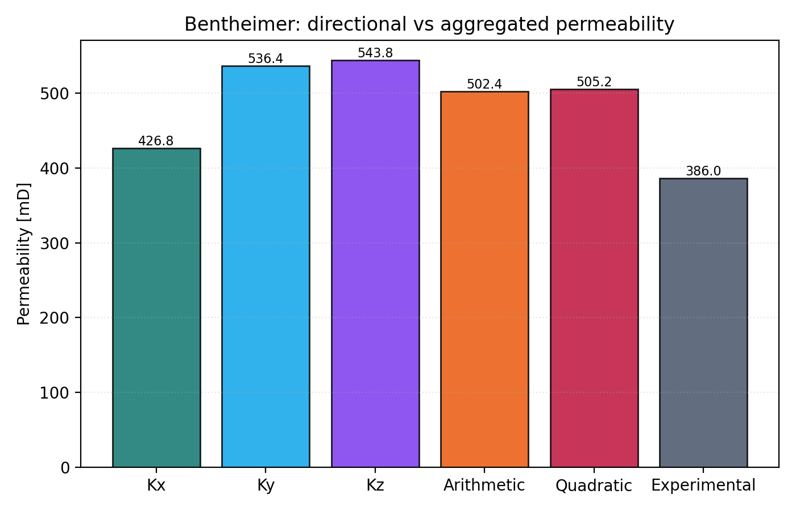

# DRP-317 Bentheimer Notebook Report

Notebook: `19_mwe_drp317_bentheimer_raw_porosity_perm`

## Sources

- Dataset: Neumann, R., ANDREETA, M., Lucas-Oliveira, E. (2020, October 7).
  *11 Sandstones: raw, filtered and segmented data* [Dataset].
  Digital Porous Media Portal. <https://www.doi.org/10.17612/f4h1-w124>
- Experimental reference paper: Neumann, R. F., Barsi-Andreeta, M., Lucas-Oliveira, E.,
  Barbalho, H., Trevizan, W. A., Bonagamba, T. J., & Steiner, M. B. (2021).
  *High accuracy capillary network representation in digital rock reveals permeability scaling functions*.
  *Scientific Reports, 11*, 11370. <https://doi.org/10.1038/s41598-021-90090-0>

## Current Setup

- Raw volume: `Bentheimer_2d25um_binary.raw`
- ROI size: `300 x 300 x 300` voxels
- Selected ROI origin: `(0, 0, 700)`
- Conductance model: `generic_poiseuille`
- Viscosity model: tabulated water viscosity from `thermo`, `298.15 K`
- Boundary pressures: `pout = 5.0 MPa`, `pin = pout + 10 kPa/m * L`

## Key Results

| Quantity | Value |
|---|---:|
| Experimental porosity [%] | 22.64 |
| Full-image porosity [%] | 26.72 |
| ROI porosity [%] | 26.75 |
| Network absolute porosity [%] | 27.57 |
| Experimental permeability [mD] | 386.0 |
| Kx [mD] | 426.82 |
| Ky [mD] | 536.39 |
| Kz [mD] | 543.85 |
| Arithmetic mean permeability [mD] | 502.35 |
| Quadratic-mean permeability [mD] | 505.19 |
| Relative quadratic-mean error [%] | 30.88 |

## Interpretation

Bentheimer remains noticeably high relative to the experimental reference, but
the result is still within the same order of magnitude and behaves like a
plausible PNM overshoot rather than a complete workflow failure.

The strong bias in both porosity and permeability suggests that representativeness
and extracted-network geometry remain more important than the switch from
constant viscosity to the new pressure-dependent viscosity model.
