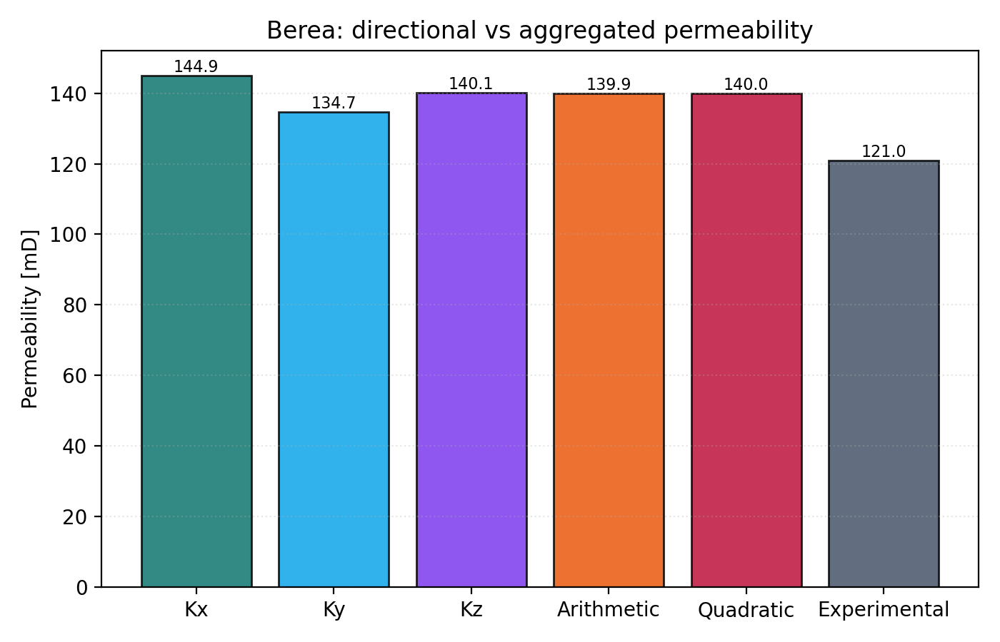

# DRP-317 Berea Notebook Report

Notebook: `18_mwe_drp317_berea_raw_porosity_perm`

## Sources

- Dataset: Neumann, R., ANDREETA, M., Lucas-Oliveira, E. (2020, October 7).
  *11 Sandstones: raw, filtered and segmented data* [Dataset].
  Digital Porous Media Portal. <https://www.doi.org/10.17612/f4h1-w124>
- Experimental reference paper: Neumann, R. F., Barsi-Andreeta, M., Lucas-Oliveira, E.,
  Barbalho, H., Trevizan, W. A., Bonagamba, T. J., & Steiner, M. B. (2021).
  *High accuracy capillary network representation in digital rock reveals permeability scaling functions*.
  *Scientific Reports, 11*, 11370. <https://doi.org/10.1038/s41598-021-90090-0>

## Current Setup

- Raw volume: `Berea_2d25um_binary.raw`
- ROI size: `256 x 256 x 256` voxels
- Selected ROI origin: `(0, 744, 0)`
- Conductance model: `generic_poiseuille`
- Viscosity model: tabulated water viscosity from `thermo`, `298.15 K`
- Boundary pressures: `pout = 5.0 MPa`, `pin = pout + 10 kPa/m * L`

## Key Results

| Quantity | Value |
|---|---:|
| Experimental porosity [%] | 18.96 |
| Full-image porosity [%] | 21.67 |
| ROI porosity [%] | 21.32 |
| Network absolute porosity [%] | 21.82 |
| Experimental permeability [mD] | 121.0 |
| Kx [mD] | 144.91 |
| Ky [mD] | 134.71 |
| Kz [mD] | 140.13 |
| Arithmetic mean permeability [mD] | 139.92 |
| Quadratic-mean permeability [mD] | 139.98 |
| Relative quadratic-mean error [%] | 15.69 |

## Interpretation

Berea is currently the closest of the three DRP-317 rocks. The permeability is
still high, but the overshoot is moderate compared with the previous centered-ROI
baseline and with the other two sandstone cases.

The remaining gap is aligned with the porosity bias: both the full image and the
selected ROI are more porous than the experimental reference, and the extracted
network remains more conductive than the measured rock response.
